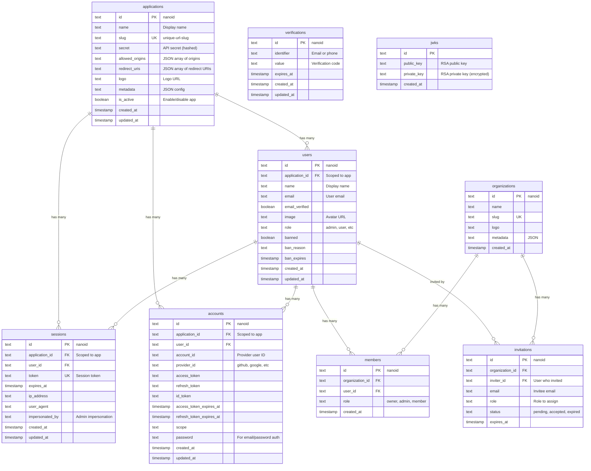
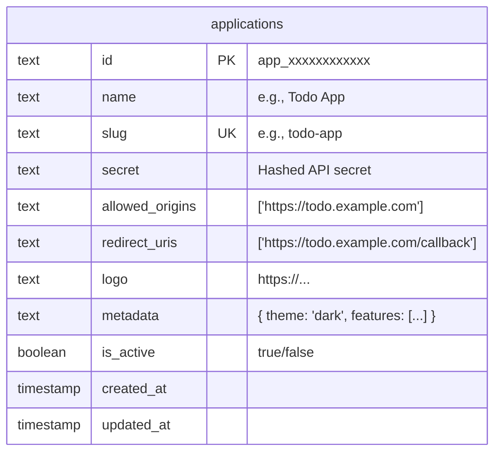
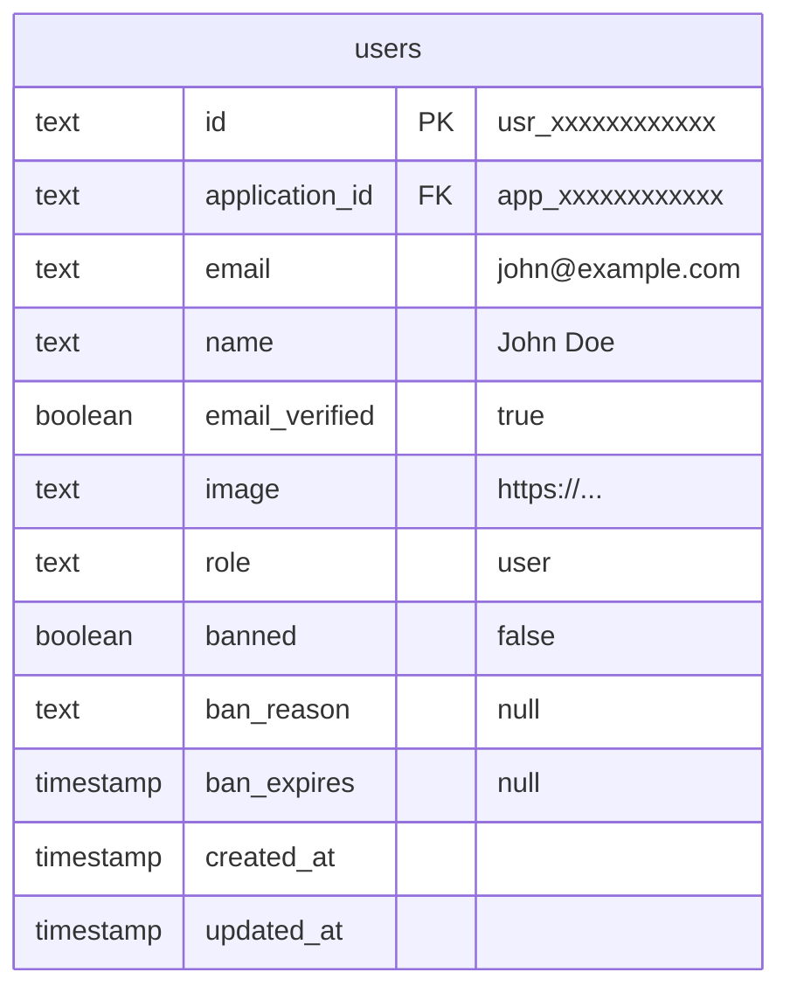
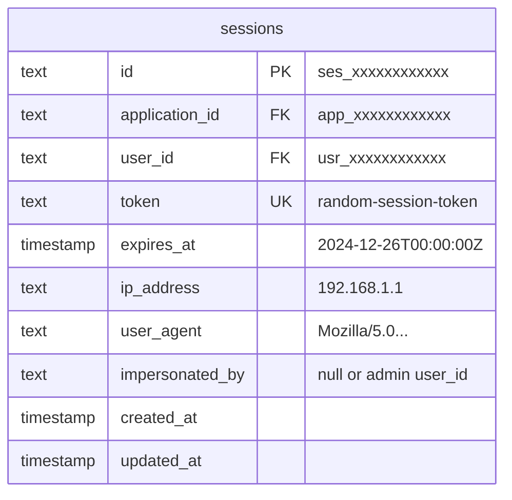
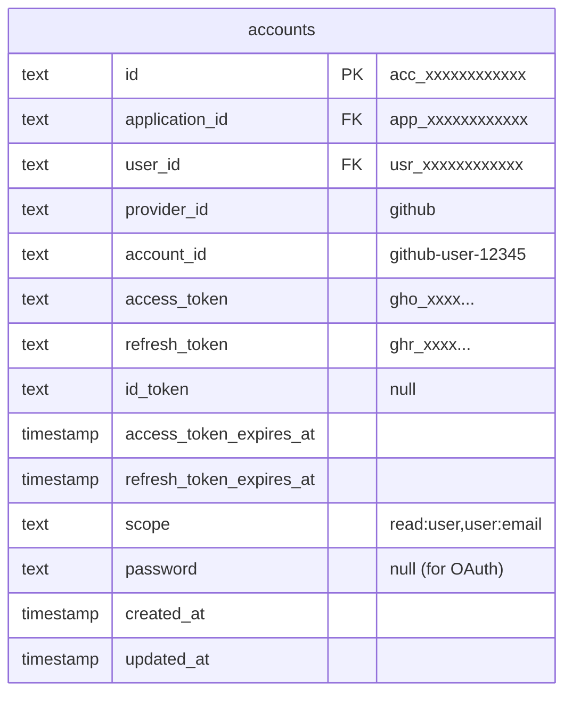

# au1h Entity Relationship Diagram

## Database Schema Overview

This document describes the database schema for au1h, a centralized multi-application authentication system.

---

## Complete ER Diagram



---

## Core Tables Detail

### 1. Applications Table (NEW)

Central table for managing registered applications.



**Key Fields:**

- `slug` - Used in `x-app-id` header and URLs
- `secret` - Used by backend services to verify requests
- `allowed_origins` - CORS origins for this app
- `redirect_uris` - Valid OAuth callback URLs
- `is_active` - Disable app without deleting

---

### 2. Users Table (MODIFIED)

Users are now scoped to applications.



**Changes from base Better Auth:**

- Added `application_id` foreign key
- Unique constraint: `(email, application_id)` instead of just `email`

**This enables:**

```
john@example.com in todo-app  →  usr_001
john@example.com in blog-app  →  usr_002  (different user!)
```

---

### 3. Sessions Table (MODIFIED)

Sessions are scoped to both user AND application.



**Changes from base Better Auth:**

- Added `application_id` foreign key

**This enables:**

- Logging out of one app doesn't affect others
- Session listing per application in admin portal
- Application-specific session policies

---

### 4. Accounts Table (MODIFIED)

OAuth accounts are scoped to applications.



**Changes from base Better Auth:**

- Added `application_id` foreign key
- Unique constraint: `(provider_id, account_id, application_id)`

**This enables:**

- Same GitHub account can be linked in multiple apps
- Each app has its own OAuth tokens
- Independent provider connections per app

---

## Indexes & Constraints

### Unique Constraints

```sql
-- Applications
ALTER TABLE applications ADD CONSTRAINT applications_slug_unique UNIQUE (slug);

-- Users: Same email allowed in different apps
ALTER TABLE users DROP CONSTRAINT users_email_unique;
ALTER TABLE users ADD CONSTRAINT users_email_app_unique UNIQUE (email, application_id);

-- Accounts: Same provider account allowed in different apps
ALTER TABLE accounts ADD CONSTRAINT accounts_provider_app_unique
    UNIQUE (provider_id, account_id, application_id);

-- Sessions: Token must be globally unique
ALTER TABLE sessions ADD CONSTRAINT sessions_token_unique UNIQUE (token);
```

### Foreign Keys

```sql
-- Users belong to an application
ALTER TABLE users ADD CONSTRAINT users_application_id_fkey
    FOREIGN KEY (application_id) REFERENCES applications(id) ON DELETE CASCADE;

-- Sessions belong to an application
ALTER TABLE sessions ADD CONSTRAINT sessions_application_id_fkey
    FOREIGN KEY (application_id) REFERENCES applications(id) ON DELETE CASCADE;

-- Accounts belong to an application
ALTER TABLE accounts ADD CONSTRAINT accounts_application_id_fkey
    FOREIGN KEY (application_id) REFERENCES applications(id) ON DELETE CASCADE;
```

### Performance Indexes

```sql
-- Fast user lookup by email + app
CREATE INDEX idx_users_email_app ON users(email, application_id);

-- Fast session lookup by token
CREATE INDEX idx_sessions_token ON sessions(token);

-- Fast session lookup by user + app
CREATE INDEX idx_sessions_user_app ON sessions(user_id, application_id);

-- Fast account lookup by provider + app
CREATE INDEX idx_accounts_provider_app ON accounts(provider_id, account_id, application_id);
```

---

## Row-Level Security (RLS) Policies

### Setting Application Context

```sql
-- Set current application context (called by au1h server)
CREATE OR REPLACE FUNCTION set_app_context(app_id TEXT)
RETURNS VOID AS $$
BEGIN
    PERFORM set_config('app.current_application_id', app_id, TRUE);
END;
$$ LANGUAGE plpgsql;

-- Get current application context
CREATE OR REPLACE FUNCTION current_app_id()
RETURNS TEXT AS $$
BEGIN
    RETURN current_setting('app.current_application_id', TRUE);
END;
$$ LANGUAGE plpgsql;
```

### RLS Policies

```sql
-- Enable RLS on tables
ALTER TABLE users ENABLE ROW LEVEL SECURITY;
ALTER TABLE sessions ENABLE ROW LEVEL SECURITY;
ALTER TABLE accounts ENABLE ROW LEVEL SECURITY;

-- Users: Can only see users in current app context
CREATE POLICY users_app_isolation ON users
    USING (application_id = current_app_id());

-- Sessions: Can only see sessions in current app context
CREATE POLICY sessions_app_isolation ON sessions
    USING (application_id = current_app_id());

-- Accounts: Can only see accounts in current app context
CREATE POLICY accounts_app_isolation ON accounts
    USING (application_id = current_app_id());

-- Bypass policy for admin portal (uses separate role)
CREATE POLICY admin_full_access ON users
    FOR ALL TO au1h_admin
    USING (TRUE);
```

---

## Data Flow Examples

### Example 1: User Registration

```
Input:
  email: john@example.com
  provider: github
  app_id: todo-app

Database State After:
┌─────────────────────────────────────────────────────────┐
│ applications                                            │
├──────────────┬────────────┬─────────────────────────────┤
│ id           │ slug       │ name                        │
│ app_001      │ todo-app   │ Todo Application            │
└──────────────┴────────────┴─────────────────────────────┘

┌─────────────────────────────────────────────────────────┐
│ users                                                   │
├──────────────┬──────────────┬───────────────────────────┤
│ id           │ app_id       │ email                     │
│ usr_001      │ app_001      │ john@example.com          │
└──────────────┴──────────────┴───────────────────────────┘

┌────────────────────────────────────────────────────────┐
│ accounts                                               │
├──────────────┬──────────────┬───────────┬──────────────┤
│ id           │ app_id       │ provider  │ user_id      │
│ acc_001      │ app_001      │ github    │ usr_001      │
└──────────────┴──────────────┴───────────┴──────────────┘

┌─────────────────────────────────────────────────────────┐
│ sessions                                                │
├──────────────┬──────────────┬───────────────────────────┤
│ id           │ app_id       │ user_id                   │
│ ses_001      │ app_001      │ usr_001                   │
└──────────────┴──────────────┴───────────────────────────┘
```

### Example 2: Same Email in Different Apps

```
┌─────────────────────────────────────────────────────────┐
│ users                                                   │
├──────────────┬──────────────┬───────────────────────────┤
│ id           │ app_id       │ email                     │
│ usr_001      │ todo-app     │ john@example.com          │
│ usr_002      │ blog-app     │ john@example.com          │ ← Different user!
│ usr_003      │ chat-app     │ john@example.com          │ ← Different user!
└──────────────┴──────────────┴───────────────────────────┘
```

---

## Schema Migration Path

### Current State (Before)

```
users.email: UNIQUE
accounts: no application context
sessions: no application context
```

### Target State (After)

```
applications: NEW TABLE
users.application_id: FK to applications, UNIQUE(email, application_id)
accounts.application_id: FK to applications
sessions.application_id: FK to applications
```

### Migration Steps

1. Create `applications` table
2. Create default "admin-portal" application
3. Add `application_id` columns (nullable initially)
4. Migrate existing data to admin-portal app
5. Make `application_id` NOT NULL
6. Drop old unique constraints
7. Add new composite unique constraints
8. Enable RLS policies

---

## Summary

| Table           | Application Scoped? | Key Change              |
| --------------- | ------------------- | ----------------------- |
| `applications`  | N/A (new table)     | Stores registered apps  |
| `users`         | ✅ Yes              | `UNIQUE(email, app_id)` |
| `sessions`      | ✅ Yes              | Scoped to user + app    |
| `accounts`      | ✅ Yes              | OAuth per app           |
| `verifications` | ❌ No               | Global (email codes)    |
| `jwks`          | ❌ No               | Global (signing keys)   |
| `organizations` | ❌ No               | Global feature          |
| `members`       | ❌ No               | Linked to users         |
| `invitations`   | ❌ No               | Linked to orgs          |
