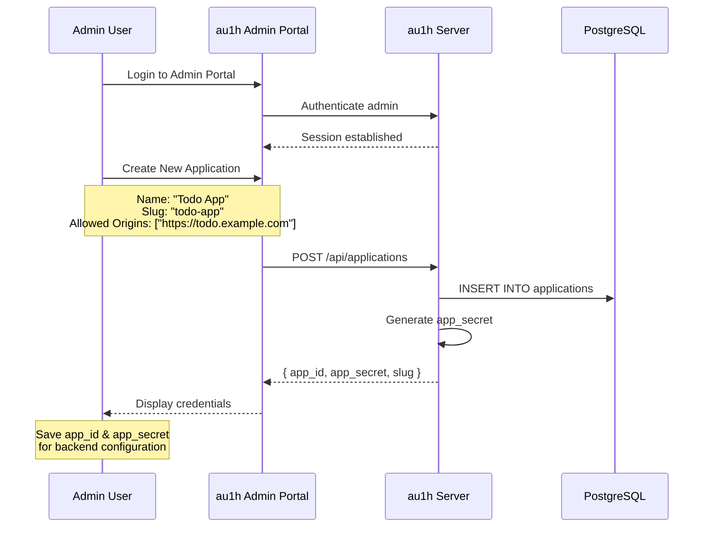
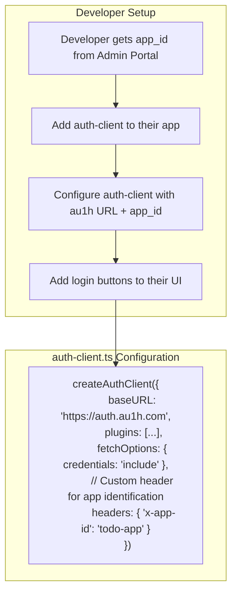
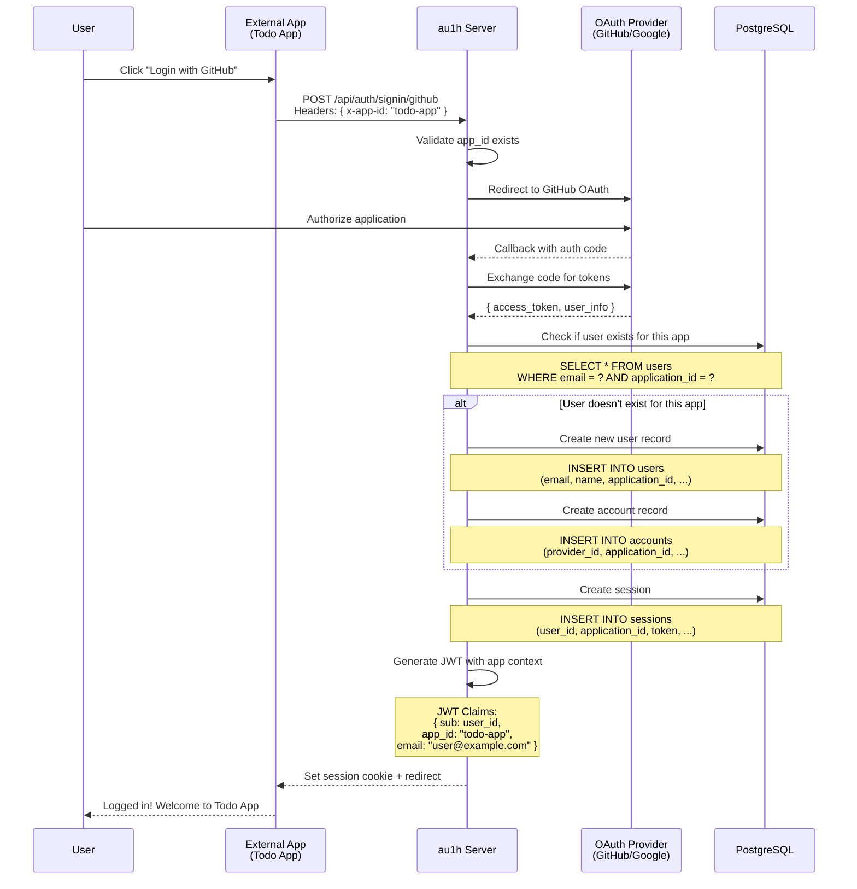
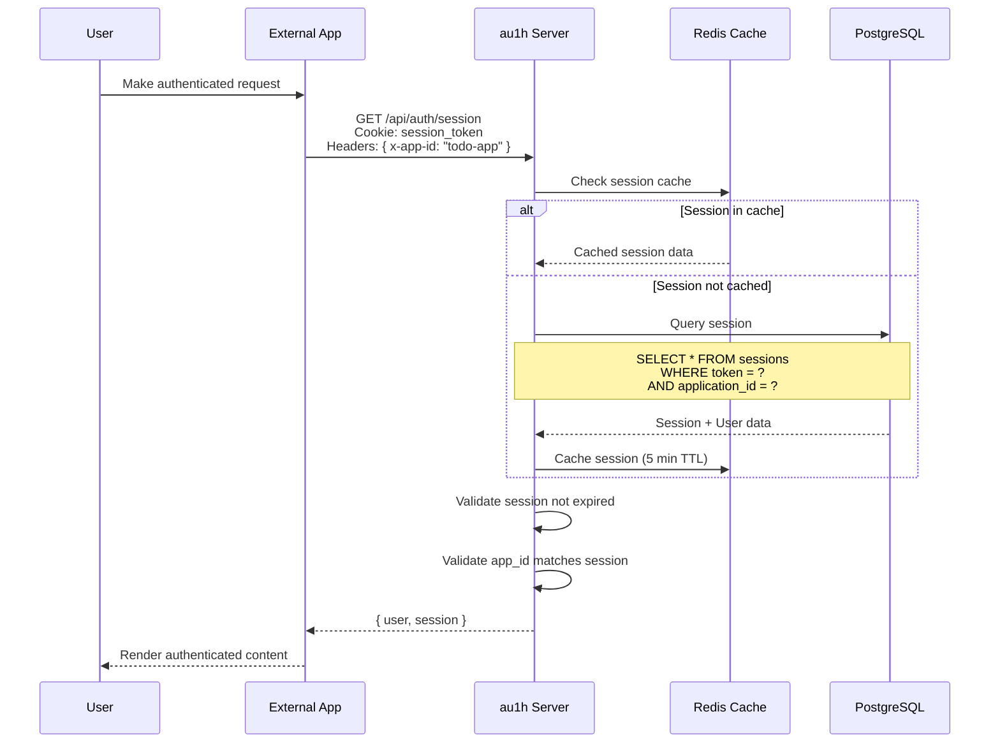
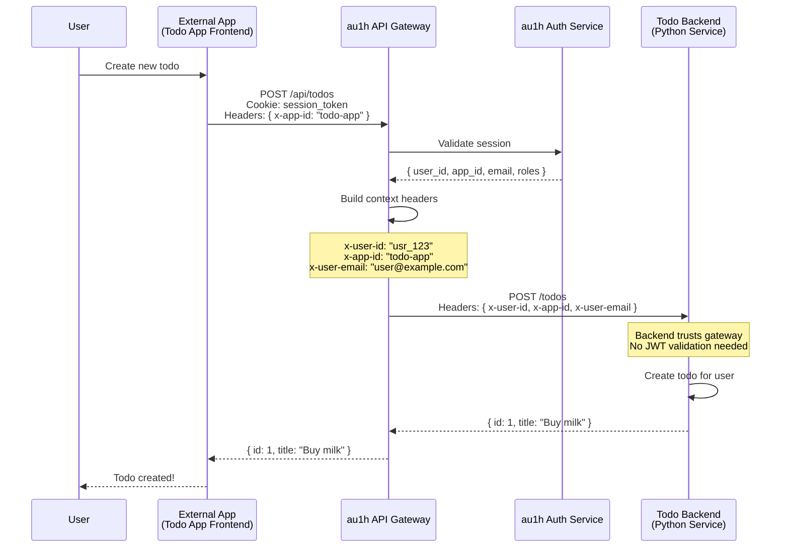
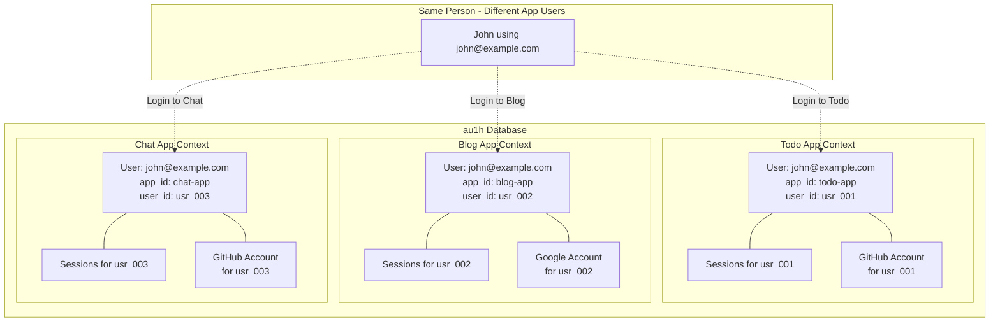
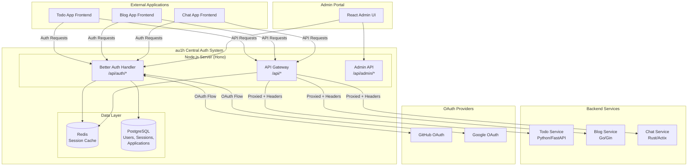
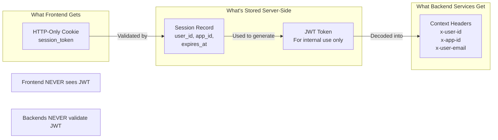

# au1h Authentication Flow Diagrams

## Overview

au1h is a centralized authentication service that allows multiple external applications to use a single auth backend while maintaining complete data isolation between apps.

---

## 1. Application Registration Flow

Before an external app can use au1h, it must be registered in the admin portal.



---

## 2. External App Integration Setup

How a developer integrates au1h into their application.



### Code Example for External App

```typescript
// External app's auth-client.ts
import { createAuthClient } from "better-auth/react";

export const authClient = createAuthClient({
  baseURL: "https://auth.au1h.com", // Points to au1h server
  plugins: [],
  fetchOptions: {
    credentials: "include",
    headers: {
      "x-app-id": "todo-app", // Application identifier
    },
  },
});

export const { signIn, signOut, useSession } = authClient;
```

---

## 3. User Authentication Flow (OAuth - GitHub/Google)

Complete flow when a user logs into an external app using au1h.



---

## 4. Session Validation Flow

How au1h validates sessions for API requests.



---

## 5. API Gateway Proxy Flow

How requests flow through au1h gateway to backend services.



---

## 6. Multi-App Isolation Demonstration

Same user email across different applications - completely isolated.



### Key Points:

- **Same email** can exist in multiple apps
- **Different user_id** for each app
- **Sessions are isolated** - logging out of Todo doesn't affect Blog
- **Different OAuth providers** can be used per app

---

## 7. Complete System Architecture



---

## 8. Token & Session Strategy



### Security Benefits:

1. **No JWT in browser** - Can't be stolen via XSS
2. **HTTP-Only cookies** - JavaScript can't access
3. **Backend simplicity** - Just read headers, no crypto
4. **Centralized revocation** - Delete session = immediate logout

---

## Summary

| Component            | Responsibility                                            |
| -------------------- | --------------------------------------------------------- |
| **External App**     | Provides UI, uses auth-client with `x-app-id` header      |
| **au1h Auth**        | Handles OAuth, sessions, user management per app          |
| **au1h Gateway**     | Validates sessions, proxies requests with context headers |
| **Backend Services** | Trust gateway headers, focus on business logic            |
| **Admin Portal**     | Manage applications, view users, system config            |
